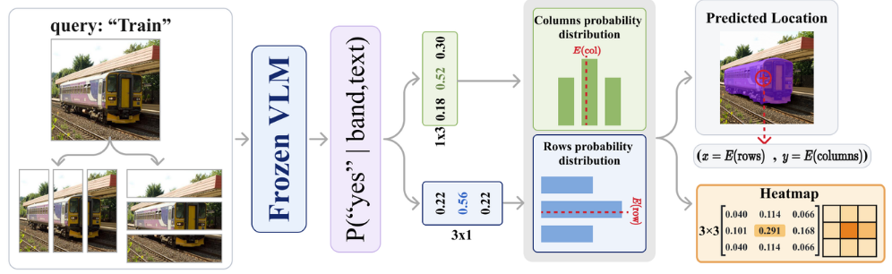
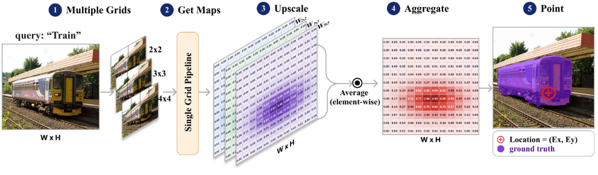

# AnswerMap: Faithful Spatial Interpretability of Vision Language Models from Answer Posteriors
**Authors:** [Mohamed Eltahir](https://www.linkedin.com/in/mohammad2012191/), [Fardows Adam](https://www.linkedin.com/in/fardows-ahmed/), [Duaa M. Tahir](https://www.linkedin.com/in/duaatahir5/), [Lama Alamoudi](https://www.linkedin.com/in/lama-amoudi/), [Sana Ammar](https://www.linkedin.com/in/sana-ammar-b0491a1b2/), [Atheer A. Alboloshi](https://www.linkedin.com/in/atheer-abdulqader-alboloshi-0a42683b4/), [Jory Albluey](https://www.linkedin.com/in/jory-alsuhaimi-87a802407/), [Tanveer Hussain](https://www.linkedin.com/in/tinu445/) and [Naeemullah Khan](https://www.linkedin.com/in/profkhan/).

<div align="center">

[](https://arxiv.org/abs/2609.35247)
[](https://colab.research.google.com/github/sanataff/AnswerMap/blob/main/demo.ipynb)
[](https://colab.research.google.com/github/sanataff/AnswerMap/blob/main/gpt6_demo.ipynb)

Try AnswerMap on Colab: **[open-source models](https://colab.research.google.com/github/sanataff/AnswerMap/blob/main/demo.ipynb)** (free GPU), or **[GPT-6 through the API](https://colab.research.google.com/github/sanataff/AnswerMap/blob/main/gpt6_demo.ipynb)** (bring your OpenAI key).

</div>

<div align="center">
  
  <p><em>The AnswerMap operator. K row and K column yes/no band questions fill a K×K map through the outer product. The expectation is the location read-out, and the model stays sealed throughout.</em></p>
</div>


---

## Highlights
- **The AnswerMap operator**: Ask the frozen model 2K yes/no questions of the form *"is the {query} in this band"* over K row and K column bands, and read the yes posterior from **first-token logits**. The outer product gives a K×K query-conditioned map, its **expectation** is the location and its **maximum** is the grounding strength.
- **Black-box and training-free**: Needs only top-k first-token logprobs. No weights, gradients or attention, and the map exists **before any answer is generated**.
- **Faithful by two tests**: The map agrees with the model's own pointing (NSS 1.36 / AUC 0.824 on RefCOCOg, where attention is below chance at every layer) and is causally necessary (deleting its region flips 53.4% of TextVQA answers vs 3.3% for a random region).
- **Multigrid product**: Multiplying coprime {3,5} grids is a drop-in replacement for 8×8 at the same 16-query cost (NSS 1.56 / AUC 0.853).
- **Applications**: Label-free hallucination audit on POPE (ROC-AUC 0.833), coordinate-free pointing for models that cannot emit coordinates, and self-conditioning by re-reading where the map points.
- **Plug-and-play**: Works with any HuggingFace `AutoModelForImageTextToText` backbone. Evaluated on Qwen3-VL (4B / 8B / 30B-A3B), InternVL3.5-8B and Lingshu-7B.
---


## News
- [2026-09] Code released. arXiv preprint released.
---


## Methodology
<div align="center">
  
  <p><em>The multigrid pipeline. Several coprime grids are probed independently, upscaled to a common resolution, and combined as a product of experts to give the final location read-out.</em></p>
</div>

---

# Guide for AnswerMap

## 🧩 Prerequisites
- Python **3.10+**
- CUDA-compatible GPU (paper numbers were produced on a single **A100 80GB**, bf16)
- `conda` or `pip` package manager

---

## ⚙️ Installation

```bash
# Clone the repository
git clone https://github.com/sanataff/AnswerMap.git
cd AnswerMap

# Install dependencies
pip install -r requirements.txt
```

Run every command from the repository root.

---

## AnswerMap Usage Guide

### 1. Use AnswerMap on Your Own Image and Query

```bash
python -m AnswerMap.demo \
  --image photo.jpg \
  --query "the red car" \
  --model_name Qwen/Qwen3-VL-4B-Instruct \
  --out map.png
```

Prints the location and strength of the query and saves the map overlaid on the image. Add `--Ks 3,5` for the sharper multigrid map.

Swap `--model_name` to `Qwen/Qwen3-VL-8B-Instruct`, `Qwen/Qwen3-VL-30B-A3B-Instruct`, `OpenGVLab/InternVL3_5-8B-HF` or `lingshu-medical-mllm/Lingshu-7B` for the other models in the paper, or to `Qwen/Qwen3-VL-2B-Instruct` for smaller GPUs.

### 2. Reproduce the Paper Results

**Data.** RefCOCOg, RefCOCO+, TextVQA, GQA and POPE are downloaded automatically. CAVE must be obtained from the [official release](https://github.com/wacv-cave/cave) and converted with `prep_cave`. `$CD` is the HuggingFace cache directory; omit `--cache_dir $CD` to use the default.

```bash
python -m AnswerMap.prep.prep_refcoco --dataset refcocog --split validation --limit 800 --out_dir data/refcocog --cache_dir $CD
python -m AnswerMap.prep.prep_refcoco --dataset refcocop --limit 800 --out_dir data/refcocop --cache_dir $CD
python -m AnswerMap.prep.prep_vqa --dataset textvqa --limit 500 --out_dir data/textvqa --cache_dir $CD
python -m AnswerMap.prep.prep_vqa --dataset gqa --limit 800 --out_dir data/gqa --cache_dir $CD
python -m AnswerMap.prep.prep_vqa --dataset pope --limit 0 --out_dir data/pope --cache_dir $CD
python -m AnswerMap.prep.prep_cave --src /path/to/cave_annotations.json --images_dir /path/to/cave/images --out_dir data/cave
```

**Test 1: Agreement.** Attention baselines are evaluated at their best decoder layer, found by a layer sweep (15 for Qwen3-VL-4B, 24 for Qwen3-VL-8B). For RefCOCO+ or CAVE, set `--data` and `--images_dir` to `data/refcocop` or `data/cave`.

```bash
python -m AnswerMap.eval.exp_attn_layer_sweep \
  --data data/refcocog/refcocog.jsonl --images_dir data/refcocog/images \
  --limit 200 --cache_dir $CD --out runs/attn_layer_sweep.json

python -m AnswerMap.eval.exp_agreement \
  --data data/refcocog/refcocog.jsonl --images_dir data/refcocog/images \
  --methods probe1,probeMG,attn_best,attn_raw,attn_rollout,tmm,tmm_last,occlusion,random \
  --Ks 3,5 --attn_layer 15 --limit 0 --cache_dir $CD --out runs/agreement_refcocog.json
```

**Test 2: Deletion.** Add `--corrupt blur` for the blur variant, and `--exclude_binary 1` on GQA.

```bash
python -m AnswerMap.eval.exp_deletion \
  --data data/textvqa/data.jsonl --images_dir data/textvqa/images \
  --methods probe,raw_attention,raw_attention_best,rollout,tmm --attn_layer 15 \
  --limit 400 --cache_dir $CD --out runs/deletion_textvqa.json
```

**Applications.**

```bash
# Hallucination audit (POPE)
python -m AnswerMap.eval.exp_hallucination \
  --data data/pope/data.jsonl --images_dir data/pope/images \
  --limit 0 --cache_dir $CD --out runs/halluc_pope.json

# Coordinate-free pointing (coordinate-blind Lingshu-7B)
python -m AnswerMap.eval.exp_pointing \
  --data data/refcocog/refcocog.jsonl --images_dir data/refcocog/images \
  --model_name lingshu-medical-mllm/Lingshu-7B \
  --limit 300 --cache_dir $CD --out runs/pointing_lingshu.json

# Self-conditioning
python -m AnswerMap.eval.exp_selfconditioning \
  --data data/textvqa/data.jsonl --images_dir data/textvqa/images \
  --sender Qwen/Qwen3-VL-30B-A3B-Instruct --receiver Qwen/Qwen3-VL-4B-Instruct \
  --self_via crop --limit 500 --cache_dir $CD --out runs/selfcond_textvqa.json
```

**Cost per map.** At 30B, run with `--groups blackbox`.

```bash
python -m AnswerMap.eval.bench_cost \
  --data data/refcocog/refcocog.jsonl --images_dir data/refcocog/images \
  --n 20 --cache_dir $CD --out runs/bench_cost_4b.json
```

Every script takes `--model_name` to run the other backbones in the table above.

---

## Configuration Parameters

| Parameter | Description | Default |
|-----------|-------------|---------|
| `--model_name` | HuggingFace model id | `Qwen/Qwen3-VL-4B-Instruct` |
| `--K` | Grid side (2K band probes per map) | `8` |
| `--Ks` | Multigrid sizes, comma list | `2,3,5` (demo: single grid) |
| `--combine` | Multigrid fusion rule: `product`, `mean`, `max` | `product` |
| `--probe_side` | Image long side for probing | `512` |
| `--attn_layer` | Decoder layer for the attention baseline | `15` |
| `--limit` | Number of rows, `0` = all | varies |
| `--cache_dir` | HuggingFace model cache | `None` |
| `--out` | Output path | `runs/*.json` |

---

## 📝 Citation

If you use AnswerMap in your research, please cite:

```bibtex
@misc{eltahir2026answermapfaithfulspatialinterpretability,
      title={AnswerMap: Faithful Spatial Interpretability of VLMs from Answer Posteriors}, 
      author={Mohamed Eltahir and Fardows Adam and Duaa M. Tahir and Lama Alamoudi and Sana Ammar and Atheer A. Alboloshi and Jory Albluey and Tanveer Hussain and Naeemullah Khan},
      year={2026},
      eprint={2609.35247},
      archivePrefix={arXiv},
      primaryClass={cs.CV},
      url={https://arxiv.org/abs/2609.35247}, 
}
```
